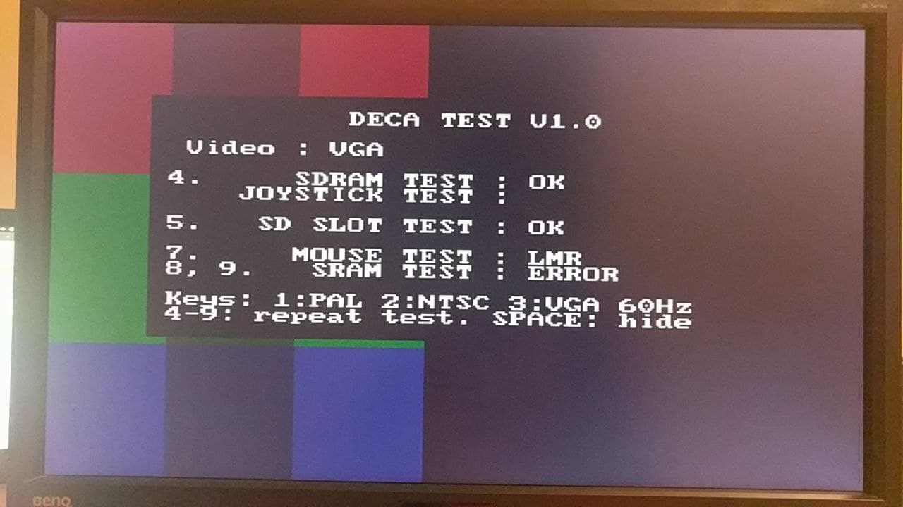

# DECA board test core

Ported from Neptuno board test https://github.com/neptuno-fpga/board_test

Tested with PS2 & R2R VGA adapter (333)  https://www.waveshare.com/vga-ps2-board.htm

Tested with 32 MB SDRAM board for MiSTer (extra slim) XS_2.2 ([see connections](https://github.com/SoCFPGA-learning/DECA/tree/main/Projects/sdram_mister_deca))

Sound tested with Atlas (J2:1 left ye, J2:3 right gn)

PS2 mouse tested with Atlas board

**Changelog**:

* v0.1 VGA only. SDRAM working

#### Includes

 - SDRAM test
 - SD slot test
 - Sigma delta sound test
 - VGA / RGB PAL & NTSC test
 - Keyboard & mouse tests
 - ~~Joystick 1 & 2 test (2 buttons for now)~~
 - ~~Addon SRAM test (1024x16)~~

#### Main changes to the core

* Pin definitions
* [VGA 666 to 333](https://github.com/SoCFPGA-learning/DECA/blob/main/Tutorials/Porting-Cores/vga666-333.md)

#### Screen

